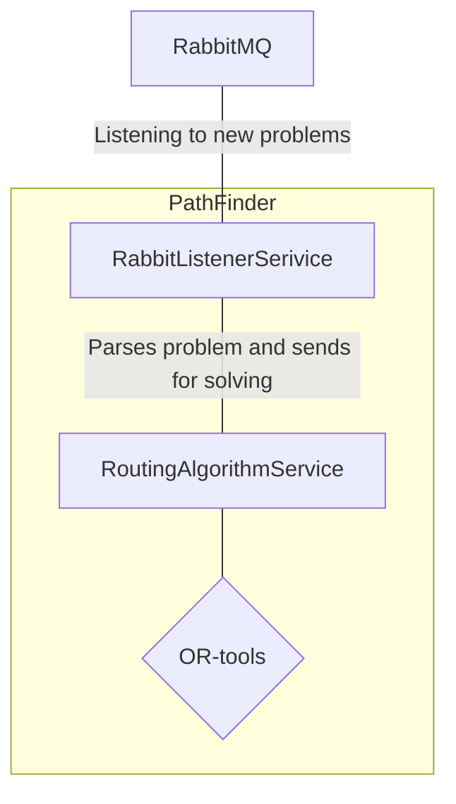

# PathFinder
PathFinder is a service for finding the shortest path for vehicles in array of points.
For solving this problem, we use the OR-Tools library.

## Setup and run
Service uses poetry for package management. To install all dependencies, run:
```bash
pip3 install poetry
poetry install --only main
```

### Environment variables
Service uses environment variables for configuration. Here is the list of all variables:

#### RabbitMQ connection
- `PATHFINDER_RABBIT_HOST` - RabbitMQ host
- `PATHFINDER_RABBIT_PORT` - RabbitMQ port
- `PATHFINDER_RABBIT_USER` - RabbitMQ user
- `PATHFINDER_RABBIT_PASSWORD` - RabbitMQ password
- `PATHFINDER_RABBIT_VHOST` - RabbitMQ vhost

#### Listener service queues

- `PATHFINDER_RABBIT_LISTENER_DEFAULT_RESPONSE_QUEUE` - queue for default response, default value is `cb.RoutingProblems.Solutions`
- `PATHFINDER_RABBIT_LISTENER_PROBLEMS_QUEUE` - queue for problems, default value is `cb.RoutingProblems.Problems`

### Run service

To run the service, run:
```bash
poetry run python pathfinder/main.py
```

## Run tests
Before running tests, install dev dependencies:
```bash
poetry install --with dev
```

To run tests, run:
```bash
poetry run pytest
```

## Service architecture



### Services description
- `RabbitListenerService` - service for listening to RabbitMQ queue for new problems. 
- `RoutingAlgorithmService` - service for solving routing problems. It uses OR-tools library for solving the problem.

### Flow description
1. `RabbitListenerService` receives new problem from RabbitMQ queue
2. `RabbitListenerService` parses problem and sends it to `RoutingAlgorithmService`
3. `RoutingAlgorithmService` solves the problem and sends solution back to `RabbitListenerService`
4. `RabbitListenerService` sends solution to RabbitMQ queue