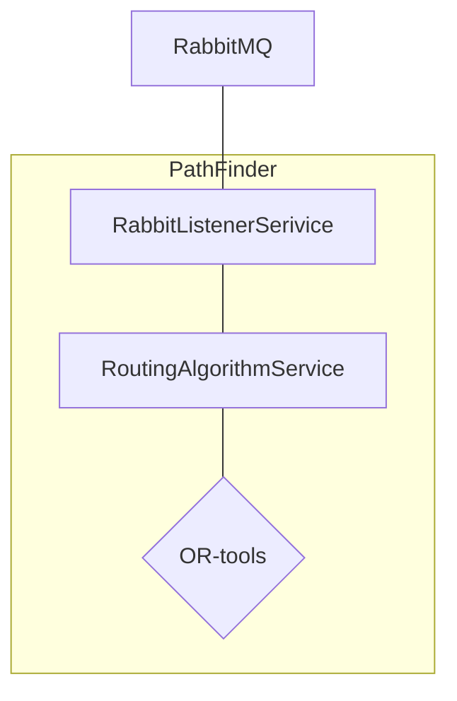

# PathFinder

PathFinder is a service for finding the shortest vehicle path in an array of points.
To solve this problem, we use the OR-Tools library.

## Setup and run

Service uses poetry for package management. To install all dependencies, run:

```bash
pip3 install poetry
poetry install --only main
```

### Environment variables

Service uses environment variables for configuration. Here is the list of all variables:

#### RabbitMQ connection

- `PATHFINDER_RABBIT_HOST` - RabbitMQ host
- `PATHFINDER_RABBIT_PORT` - RabbitMQ port
- `PATHFINDER_RABBIT_USER` - RabbitMQ user
- `PATHFINDER_RABBIT_PASSWORD` - RabbitMQ password
- `PATHFINDER_RABBIT_VHOST` - RabbitMQ vhost

#### Listener service queues

- `PATHFINDER_RABBIT_LISTENER_DEFAULT_RESPONSE_QUEUE` - queue for default response, the default value
  is `cb.RoutingProblems.Solutions`
- `PATHFINDER_RABBIT_LISTENER_PROBLEMS_QUEUE` - queue for problems, the default value is `cb.RoutingProblems.Problems`

#### .env

Service supports .env file. To use it, create `.env` file in the root of the project and put all environment variables
there. For quick local setup, you can use `.env.local` file.

### Run service

Before you service starts you need to set up RabbitMQ. You can use `docker-compose.yml` file from repo folder.
To run RabbitMQ just run:

```bash
docker-compose up rabbitmq -d --wait
```

To run the service:

```bash
poetry run python pathfinder/main.py
```

## Run tests

Before running tests, install dev dependencies:

```bash
poetry install --with dev
```

To run tests, run:

```bash
poetry run pytest
```
## Interaction with service

Service uses pub/sub model for interaction with other services. 
It listens to the `PATHFINDER_RABBIT_LISTENER_PROBLEMS_QUEUE`(default `cb.RoutingProblems.Problems`)
queue for new problems and sends solutions to the `PATHFINDER_RABBIT_LISTENER_DEFAULT_RESPONSE_QUEUE`
(default `cb.RoutingProblems.Solutions`) queue.

To send request you can user RabbitMQ admin panel.

Also you can use `mockdelivery` service for testing.

Example of request:
```json
{
  "id": "test",
  "vehicle_count": 1,
  "depot_index": 0,
  "points": [
      {
        "name": "A",
        "lat": 0,
        "long": 0
      },
      {
        "name": "B",
        "lat": 1,
        "long": 1
      },
      {
        "name": "C",
        "lat": 2,
        "long": 0
      }
  ]
}
```


## Service architecture



### Services description

- `RabbitListenerService` - service for listening to RabbitMQ queue for new problems.
- `RoutingAlgorithmService` - service for solving routing problems. It uses the OR-tools library to solve the problem.

### Flow description

1. `RabbitListenerService` receives a new problem from the RabbitMQ queue
2. `RabbitListenerService` parses the problem and sends it to `RoutingAlgorithmService`
3. `RoutingAlgorithmService` solves the problem and sends the solution back to `RabbitListenerService`
4. `RabbitListenerService` sends the solution to RabbitMQ queue
